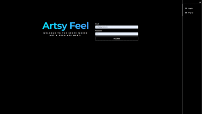
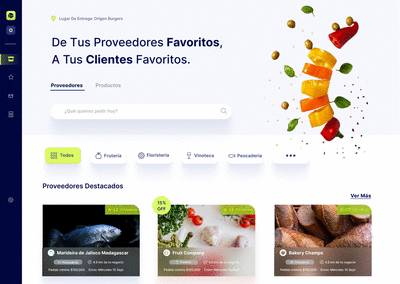

<h1 align="center">
 <a href="https://artsy-feeling.netlify.app/feed"> 🖌️ ArtsyFeel </a></h1>
 

 
 

 
                                                   

 A social network that combines art and emotions. The platform has been built using JavaScript, React, MongoDB and its layout has been designed using CSS and Bootstrap.

 <a align="center" href="https://github.com/Juligs/Af-Client"> 🔹Client repository </a>
 <a align="center" href="https://github.com/Juligs/Af-Server"> 🔹Server repository </a>
 

 
 
 <h1 align="center">
 <a href="https://www.figma.com/proto/A0oRGqHL3kr0AJoQ1K8BQa/CSABOGAL-PORTAFOLIO?node-id=291%3A1351&scaling=scale-down-width&page-id=79%3A311&starting-point-node-id=529%3A1164&hotspot-hints=0&hide-ui=1"> 🌎Digital Nomad World </a></h1>
 

 
 

 
                                                   

 A social networking site for finding work-from-home locations globally. The JS-developed app is now live and available to explore.

 <a align="center" href="https://github.com/csabogalortiz/DNW"> 🔹 Repository </a>
 

<h1 align="center">
<a href="https://csabogalortiz.github.io/GOMEZ-SABOGAL-GAME/"> 🕹️ Star Ninja </a></h1>
  

 
 

 

 An infinite platform game inspired by the famous "Doodle Jump" game. Developed in JavaScript using Canvas, CSS and bootstrap.

 <a align="center" href="https://github.com/Juligs/Juligs-NinjaStartGame"> 🔹Project repository  </a>
 

<h1 align="center"> Coming soon 👩‍💻 👩‍💻 🏗️ </h1> 

 My teammate Juliana Gomez and I are currently building and designing an e-commerce platform aimed at businesses looking to buy wholesale products of all types. Our platform, named Appura, is being developed using TypeScript, HTML, JavaScript, and React, and is being designed using CSS and Tailwind CSS. 

 

 
 

 

 <a align="center" href="https://github.com/Juligs/Appura-Supplier-client"> 🔹Client repository </a>
 <a align="center" href="https://github.com/Juligs/Appura-Supplier-server"> 🔹Server repository </a>
 

 

